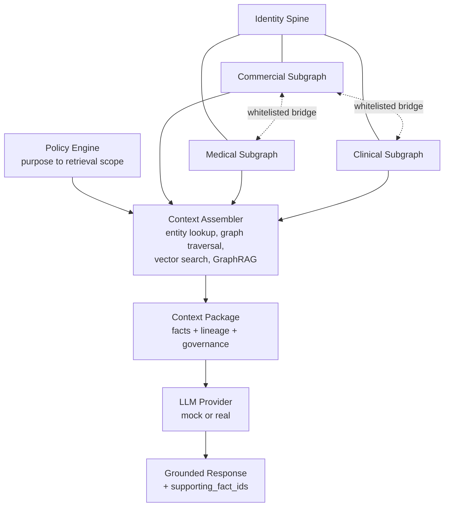

# rag-agent — Life Sciences Enterprise Context Layer (prototype)

**A Policy-Aware Enterprise Context Layer for Life Sciences AI Agents.**

Working code, not a slide deck: a policy-scoped Context API sitting over a
partitioned knowledge graph, proving that the same HCP produces provably
different, governed context depending on which agent — and therefore
which approved purpose — is asking, all the way through to a grounded LLM
response.

## 1. Problem statement

Life sciences enterprises hold one HCP's data across Commercial, Medical,
and Clinical systems, each governed by different rules (promotional
compliance, scientific exchange rules, clinical trial regulations that
firewall commercial influence from site selection). Point an AI agent at
"the data" and you've handed it something no single person is allowed to
see — a Commercial rep doesn't get MSL medical inquiry detail, a Clinical
Ops reviewer doesn't get promotional engagement history, and *nobody*
gets to have commercial data influence which sites get selected for a
trial. This isn't a data problem. It's a governance problem that happens
to involve data.

## 2. Why traditional RAG is insufficient

A RAG stack answers "what's relevant to this query." It has no opinion on
"what is this caller allowed to see" — in most RAG stacks that question
isn't answered anywhere at all, because the retrieval layer doesn't know
who's asking or why. Bolt an access-control check onto the *output* of
retrieval and you've built a filter, not a governance layer: the data was
already fetched, already sat in a prompt, already one bug away from
leaking. See ["Not traditional RAG"](#not-traditional-rag) below for the
concrete comparison table.

## 3. What is an Enterprise Context Layer?

A layer that sits between enterprise source systems and AI agents, and
decides — before any retrieval happens — what a specific agent, with a
specific published purpose, is allowed to see for a specific entity. The
core principle:

> **The LLM does not decide what enterprise data it is allowed to see.**

```
Enterprise Knowledge  +  Agent Identity  +  Approved Purpose  +  Policy
                              ↓
                   Enterprise Context Layer
                              ↓
                Policy-Compliant Context Package
                              ↓
                      LLM / AI Agent
```

Domains keep their own data (Commercial IT, Medical IT, Clinical IT stay
system-of-record owners); the Context Layer holds identity, relationships,
indexes, and the policy that scopes access to them — not a copy of every
record. See [`docs/design.md`](docs/design.md) for the original design and
[`docs/production_reference_architecture.md`](docs/production_reference_architecture.md)
for the full eight-layer target architecture this prototype is a working
model of.

## 4. Core architecture



| Layer | Code |
|---|---|
| Identity Spine + domain subgraphs + bridge whitelist | `context_layer/graph/` |
| Semantic mapping (MDM/SNOMED/MeSH crosswalk) | `context_layer/semantic/mapping.py` |
| Policy engine (Request → RetrievalScope, fail-closed) | `context_layer/policy/` |
| Retrieval (entity lookup, TF-IDF vector index, GraphRAG-lite) | `context_layer/retrieval/` |
| Context Assembler + Context Package schema | `context_layer/api/` |
| Agent Builder + ThinAgent (purpose bound at publish time) | `context_layer/agent_builder/` |
| LLM consumption (mock/real provider, response grounding) | `context_layer/llm/` |
| MCP server | `context_layer/api/mcp_server.py` |
| Evaluation (RAGAS/DeepEval/LLM-judge/deterministic governance) | `context_layer/evaluation/` — see [`docs/evaluation.md`](docs/evaluation.md) |
| Extension-point interfaces (production swap points) | `context_layer/interfaces.py` |

## 5. Key innovation

Four things most RAG-over-enterprise-data projects don't have, all
enforced in code, not just documented:

- **The bridge whitelist is data, not scattered conditionals**
  (`graph/bridges.py`) — the single choke point every graph traversal
  consults before crossing a domain boundary. `tests/test_bridge_firewall.py`
  grants *every* bridge that exists and still proves MSL interactions and
  Commercial↔Clinical/Medical crossings never appear.
- **Purpose is bound to the agent, not the caller.** `ThinAgent.get_context()`
  has no `purpose` parameter at all — fixed at publish time, and
  `agent_builder/builder.py` rejects any purpose/role combination the
  policy engine doesn't recognize. `task` (free text) only ever affects
  vector-search ranking, never the retrieval scope.
- **Policy fails closed.** An unregistered purpose, or a role not
  permitted for one, raises `PolicyDenied` — never an empty-but-present
  scope some other layer might treat as "no restriction."
- **The LLM only ever sees a `dict` Context Package.** `context_layer/llm/provider.py`'s
  `LLMProvider.generate(context_package, question)` has no reference to
  the graph store or the assembler — structurally, there is no path from
  "LLM" back to raw enterprise data.

## 6. The demo: same HCP, different purpose

```bash
./.venv/bin/python scripts/e2e_demo.py
```

Runs the full chain — `User Question → Published Agent → Purpose-bound
Config → Context API → Policy Evaluation → Context Package → LLM Prompt
→ Generated Response` — for one HCP under two agents:

- **HCP Engagement Agent** (`commercial_engagement`): commercial profile,
  approved interactions, publications bridged in (full detail), the
  investigator's clinical status collapsed to a compliance *flag*
  (never study/enrollment detail).
- **Clinical Site Selection Agent** (`site_selection`): institution
  affiliation, full study/enrollment/feasibility detail, zero bridges
  applied, zero commercial facts.

Ends with an isolation verdict computed from the same evaluators the test
suite uses (`context_layer/evaluation/isolation_evaluator.py`,
`policy_evaluator.py`) — not a hand-written assertion for the demo:

```
====================================================================
ISOLATION RESULT
====================================================================
Same Entity: YES
Same Base Data: YES
Different Purpose: YES
Different Context Packages: YES
Unauthorized Data Exposed: NO

STATUS: PASS
====================================================================
```

Pass `--real` to use a configured `ANTHROPIC_API_KEY`/`OPENAI_API_KEY`
instead of the deterministic mock provider — see `context_layer/llm/provider.py`.

`scripts/demo.py` (the earlier, narrower week-6 version of this) and
`scripts/campaign_workflow.py` (a GraphRAG-driven brand-manager
promotional campaign across all 50 HCPs — targets using `community_summary`,
an entity-specific signal, not a global content search that would "match"
everyone; see its docstring) are still here as smaller, focused demos.

## 7. Governance model

Every Context Package carries a `policy_decision` block (`allowed_domains`,
`forbidden_domains`, `allowed_bridges`, `redactions`), a `governance` block
(`domains_accessed`, `bridges_used`, `redactions_applied`), and a
`lineage` list — one entry per fact naming its `fact_id`, `source_type`,
`source_id`, `domain`, and `retrieval_method`. Nothing in a package is
unattributed. Action tools (`draft_email`, `create_campaign_task`,
`create_feasibility_note`) are authorized *before* any business logic
runs — an unauthorized caller gets `PermissionError`, never a `blocked`
result that would reveal the action ran at all — and an action named in
`guardrails.human_approval_required` is never executed directly; it's
submitted to a shared `ApprovalQueue` and returns `pending_approval`.
`agent_builder/builder.py` rejects, at publish time, any config whose
approval list names an action that isn't actually declared — the class of
bug where a guardrail silently gates nothing.

Every Context Package is audited with its request, applied scope, and
lineage (`policy/audit.py`, appended to `context_layer_audit.log`).

## 8. Evaluation framework

`context_layer/evaluation/` (full design in [`docs/evaluation.md`](docs/evaluation.md))
answers a narrower question than a typical RAG eval: not just "is the
answer good," but *"did the Context Layer return the correct,
policy-compliant, purpose-specific context in the first place."*

- **Deterministic governance** (no LLM, no API key, what CI runs on every
  push): `policy_evaluator`, `graph_evaluator`, `lineage_evaluator`,
  `isolation_evaluator` — each with tests proving they *discriminate*
  (a hand-broken input actually gets flagged).
- **RAGAS**: context precision/recall, faithfulness, answer relevancy.
  Kept as a separate optional extra (`pip install ragas`) — as of
  `ragas==0.4.3` it has a real upstream packaging bug in this
  environment (documented in `docs/evaluation.md`); the adapter degrades
  to a labeled `skipped` result rather than crashing.
- **DeepEval**: the RAG Triad + contextual precision/recall, verified
  working against the installed v4.2.0 API.
- **LLM-as-judge**: a structured rubric (correctness/relevance/faithfulness/
  policy_compliance/hallucination_risk) whose `critical_violation` is
  OR'd against the *deterministic* policy result — never solely the
  model's own self-report standing between a leak and a passing score.

A policy or bridge violation is a hard gate on the unified score,
independent of how well everything else scores — a factually perfect
answer that leaks a forbidden domain is still `FAIL`.

```bash
./.venv/bin/python -m context_layer.evaluation.runner --mode fast   # deterministic only
./.venv/bin/python -m context_layer.evaluation.runner --mode full   # + RAGAS + DeepEval + LLM Judge
```

`evaluation_reports/manual_llm_judge_pass.json` is a real judged pass —
performed directly by an LLM (Claude, in the session that built this
harness) against the identical rubric `llm_judge.py` sends to a
configured model, since this dev sandbox has no LLM API key for the
script itself to call. That pass caught a real bug: `synthesize_answer`
never read `package["relationships"]`, so a question about an HCP's
institutional affiliation went unanswered even though the data was in the
package — fixed, with a regression test.

### Not traditional RAG

| | Traditional RAG | This Context Layer |
|---|---|---|
| unit | top-k chunks by similarity | a scoped Context Package: facts, relationships, content — with lineage |
| access | whatever the queried index contains | evaluated by a policy engine before retrieval runs |
| purpose | implicit in the caller's prompt | bound to the agent definition at publish time |
| audit | a query log, if that | every package logged with request, scope, and fact lineage |
| domains | one flat index | partitioned subgraphs, crossed only by a whitelisted bridge |
| LLM's view | raw retrieved chunks | a `dict` Context Package only — no reference to the data store |

### Validation

[`docs/test_report.md`](docs/test_report.md) is a comprehensive,
adversarial test pass against this codebase — not just "tests pass," but
an independently re-verified run of the primary acceptance scenario,
explicit attack attempts (graph path attack, vector leakage, prompt
injection, runtime privilege escalation), and an explicit governance-gating
proof (excellent RAGAS/DeepEval/LLM-Judge scores still `FAIL` when a
policy or bridge violation is present). It found and fixed one real
critical defect: `AgentConfig` was a mutable pydantic model, so a
published agent's purpose and roles could be reassigned at runtime with
no exception — see the report for the fix and its regression tests
(`tests/test_privilege_escalation.py`).

## 9. Prototype vs. production

Full detail in [`docs/production_reference_architecture.md`](docs/production_reference_architecture.md).
Short version — every substitution below keeps the same contract at its
boundary, so swapping the real thing in changes nothing above it:

| | Prototype | Production target |
|---|---|---|
| Graph store | `networkx`, in-memory | Neo4j/RDF, same partition + bridge-whitelist contract |
| Policy engine | a Python rule table | OPA/Cedar, same `Request → RetrievalScope` contract |
| Vector retrieval | TF-IDF | real embeddings, enterprise vector store |
| GraphRAG | frequency-ranked extractive stub | LLM-summarized communities |
| Data | synthetic, static JSON | real CRM/CTMS/publications/MDM, live ingestion |
| Purposes implemented | 3 of the design doc's 4 (`sales_prep` undefined) | all named purposes, extensible |
| Secrets | raw env vars | a real secrets store, credential rotation |
| Approvals | in-memory `ApprovalQueue` | a UI, notifications, a real audit trail |

## 10. Quickstart

```bash
python3 -m venv .venv
./.venv/bin/pip install -e ".[dev,eval]"

# generate the synthetic fixtures (data/synthetic/*.json)
./.venv/bin/python -m context_layer.data.synthetic_gen

# the killer demo — same HCP, two agents, full chain to a grounded response
./.venv/bin/python scripts/e2e_demo.py

# the narrower week-6 demo, and a GraphRAG-driven campaign workflow
./.venv/bin/python scripts/demo.py
./.venv/bin/python scripts/campaign_workflow.py "Biomarker testing"

# tests — prove the firewall, policy engine, and scope isolation hold
./.venv/bin/python -m pytest

# evaluation — deterministic governance checks, no LLM/API key required
./.venv/bin/python -m context_layer.evaluation.runner --mode fast

# the Context API as an MCP server (stdio transport)
./.venv/bin/python -m context_layer.api.mcp_server
```

## Repository layout

```
context_layer/
  data/            synthetic data generator + source-record loader
  semantic/        MDM/standards crosswalk
  graph/           GraphStore, domain loaders, bridge whitelist
  policy/          policy engine, request/scope models, audit log
  retrieval/       entity lookup, vector index, GraphRAG-lite, answer synthesis
  api/             Context Assembler, Context Package schema, MCP server
  agent_builder/   agent config schema, publish-time validation, ThinAgent, action tools + approval queue
  llm/             LLM provider abstraction (mock/real) + response grounding
  evaluation/      RAGAS/DeepEval/LLM-judge adapters, deterministic governance evaluators, runner, reporting
  interfaces.py    production extension-point Protocols
agents/            HCP Engagement Agent, Site Selection Agent configs
data/synthetic/    generated fixtures, committed for convenience — regenerate anytime via synthetic_gen.py
docs/design.md                          the source design document
docs/evaluation.md                      the evaluation layer's design
docs/production_reference_architecture.md  prototype vs. production, vendor-neutral
evaluation_reports/  JSON/Markdown reports (git-ignored except the checked-in manual pass)
scripts/e2e_demo.py            the killer demo: agent -> policy -> context -> LLM -> grounded response
scripts/demo.py                the narrower week-6 demo
scripts/campaign_workflow.py   GraphRAG-driven brand-manager campaign workflow
tests/             firewall, policy, scope-isolation, action-tool, GraphRAG, LLM/grounding, and campaign tests
tests/evaluation/  the evaluation layer's own test suite
```
