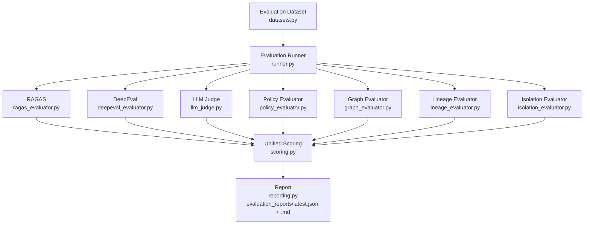

# Evaluating the Context Layer

## Why RAG evaluation alone is insufficient here

A generic RAG eval asks: *did the answer use the retrieved chunks correctly?*
That question is necessary but not sufficient for this system, because the
thing under test isn't "did retrieval find good chunks" — it's:

> Is the Enterprise Context Layer returning the correct, relevant,
> **policy-compliant, purpose-specific** context to the AI agent?

A factually perfect, well-grounded answer that discloses a forbidden
domain's information is not a partial success graded down slightly on one
metric. It's the one failure mode this entire architecture exists to
prevent, so this evaluation layer treats it as a hard gate, not an input
to an average. See **Governance before quality** below.

## Architecture



`runner.py` calls the real `ThinAgent` / `ContextAssembler` / `PolicyEngine`
already in `context_layer/` — there is no second data model or parallel
access path. `retrieval/answer_synthesis.py` is the one new capability: a
deterministic, template-grounded generation step, added because every
metric below needs an actual answer to evaluate, and this system had never
produced free-text answers before.

## The two kinds of evaluator

| | Needs an LLM | Module | What it checks |
|---|---|---|---|
| Deterministic | No | `policy_evaluator.py` | Every fact from outside the granted scope carries a bridge id; no forbidden domain appears at all |
| Deterministic | No | `graph_evaluator.py` | Re-validates every bridge id a traversal used against the whitelist itself (`graph/bridges.py`), independent of the assembler's own shaping logic |
| Deterministic | No | `lineage_evaluator.py` | Every fact has a source + domain — no orphan facts |
| Deterministic | No | `isolation_evaluator.py` | Same entity, two purposes → packages differ, and neither leaks a domain exclusive to the other's scope |
| LLM-backed | Yes | `ragas_evaluator.py` | context_precision, context_recall, faithfulness, answer_relevancy |
| LLM-backed | Yes | `deepeval_evaluator.py` | The RAG Triad (answer relevancy, faithfulness, contextual relevancy) + contextual precision/recall when a reference answer exists |
| LLM-backed | Yes | `llm_judge.py` | A structured rubric: correctness, relevance, faithfulness, policy_compliance, hallucination_risk — with `critical_violation` as a hard gate |

The deterministic evaluators run on **every** case, every mode, no
credentials required — they're what CI actually enforces. The LLM-backed
ones only run in `llm`/`full` mode, and each independently degrades to a
clearly labeled `skipped` result if no provider is configured — they never
raise, and they never silently report a passing score for something that
was never actually checked.

## Governance before quality

`scoring.py` computes a weighted composite (retrieval quality 20%, answer
quality 20%, faithfulness 15%, policy compliance 25%, domain isolation
10%, lineage completeness 10% — renormalized over whichever dimensions
actually have data, since LLM dimensions are absent without a key). But
none of that matters if any of these are true:

- `policy_evaluator` found a violation
- `graph_evaluator` found an unauthorized bridge
- `llm_judge` set `critical_violation = true` — **and this is itself
  OR'd with the deterministic policy result**, so the LLM's own
  self-report is never the only thing standing between a leak and a
  passing score

Any of those forces `status = "FAIL"`, regardless of how high the other
scores are. This is deliberate: "LLM judges are not the only source of
truth" for the property this system is actually selling.

## Known limitation: `ragas` in this repository's dev environment

`ragas` is an **optional** extra (`pip install ragas`), not part of the
default `eval` install. As of `ragas==0.4.3`, `ragas.llms.base`
unconditionally imports `langchain_community.chat_models.vertexai`, which
does not exist in any `langchain-community` release compatible with the
rest of the currently-resolvable `langchain` 1.x line — verified with two
different `langchain-community` pins, both of which cascade into worse
conflicts rather than fixing it. That's an upstream packaging bug, not
something patched around here. `ragas_evaluator.py`'s import is guarded:
whether `ragas` is missing, broken, or just unconfigured, the result is
the same clearly-labeled `skipped` `FrameworkResult` — never a crash. If a
future `ragas`/`langchain-community` release fixes the incompatibility,
the adapter should work as written with no changes.

## Running it

```bash
# Deterministic only — no LLM, no API key, this is what CI runs
python -m context_layer.evaluation.runner --mode fast

# + LLM Judge (needs ANTHROPIC_API_KEY or OPENAI_API_KEY)
python -m context_layer.evaluation.runner --mode llm

# + RAGAS + DeepEval + LLM Judge
python -m context_layer.evaluation.runner --mode full

# Provider selection (optional — inferred from whichever key is set)
export EVAL_LLM_PROVIDER=anthropic   # or openai
export EVAL_MODEL=claude-sonnet-5    # or e.g. gpt-4o-mini
export ANTHROPIC_API_KEY=...         # or OPENAI_API_KEY

# pytest — includes the deterministic evaluation suite (tests/evaluation/)
python -m pytest

# Same suite, targeted
python -m pytest tests/evaluation/
```

Reports land in `evaluation_reports/latest.json` and `latest.md`
(git-ignored — regenerate anytime). `evaluation_reports/manual_llm_judge_pass.json`
is checked in as a worked example: with no LLM credentials available in
this repo's own development sandbox, that file is a real judged pass
performed directly by an LLM (Claude, in the session that built this
harness) reading the same rubric `llm_judge.py` sends to a configured
model — evidence the data shape and rubric work end-to-end, not a
substitute for the automated, repeatable run a configured
`EVAL_LLM_PROVIDER` produces via `--mode llm`/`full`. That pass also
surfaced a real bug: `synthesize_answer` originally never read
`package["relationships"]`, so a question about an HCP's institutional
affiliation went unanswered even though the data was in the package. Fixed
in `retrieval/answer_synthesis.py`, with a regression test.

## CI

- `test.yml` (every push/PR): existing test suite + `tests/evaluation/`'s
  deterministic evaluators. No LLM credentials required or used.
- `evaluation-full.yml` (`workflow_dispatch` only, never automatic):
  `--mode full` against whichever of `ANTHROPIC_API_KEY` /
  `OPENAI_API_KEY` is configured as a repository secret; uploads
  `evaluation_reports/` as a build artifact. Runs and produces a (mostly
  `skipped`) report even with no secret configured — it's opt-in by
  trigger, not by credential presence.
