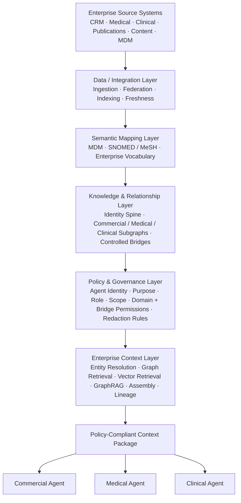

# Production Reference Architecture

This document exists to draw one line clearly: **what's actually running
in this repository** vs. **what a production deployment of the same
architecture would need**. Nothing below is a claim about what's built —
it's a vendor-neutral target the prototype is a faithful, working model
of at small scale.

## The eight layers

| # | Layer | Prototype implementation | Production target |
|---|---|---|---|
| 1 | Enterprise Source Systems | `data/synthetic_gen.py` — deterministic synthetic HCPs, institutions, content, interactions, publications, studies | Real CRM (Veeva/SFDC), CTMS/EDC/eTMF, publications feed, DAM, MDM |
| 2 | Data / Integration | `data/loader.py` reads static JSON | API/event/batch ingestion, data freshness SLAs, federation (design principle: domains keep their own data) |
| 3 | Semantic Mapping | `semantic/mapping.py` — a static concept table + one crosswalk function | Live terminology services (SNOMED CT, MeSH, RxNorm, MedDRA), versioned MDM crosswalk with confidence scoring at scale |
| 4 | Knowledge & Relationship | `graph/store.py` — in-memory `networkx.MultiDiGraph`, `graph/bridges.py` whitelist | A real graph database (property graph or RDF/SPARQL — design doc's open decision #1), same partition + bridge-whitelist contract, likely at millions of nodes |
| 5 | Policy & Governance | `policy/engine.py` — a Python rule table, fail-closed | OPA/Cedar or an equivalent policy engine; the `PolicyRequest -> RetrievalScope` contract is what's meant to survive the swap |
| 6 | Enterprise Context Layer | `api/assembler.py` (`ContextAssembler`), `retrieval/` (TF-IDF vector index, GraphRAG-lite) | Real embeddings + an enterprise vector store, LLM-summarized GraphRAG communities (design doc open decision #2), the same Context Assembler contract |
| 7 | Context Package | `api/schema.py` (`ContextPackage`) — already the shape in Phase 3 of this doc's companion request | Same shape; production adds resource-level access auditing and possibly per-tenant scoping |
| 8 | Agent / LLM Consumption | `context_layer/llm/provider.py` — `MockLLMProvider` (default) or `RealLLMProvider` (Anthropic/OpenAI via env) | Any provider behind the same `LLMProvider` protocol; the point is the LLM only ever sees a `dict` Context Package, never the graph store |

A ninth, cross-cutting layer — **Audit & Evaluation** — isn't a stage in
the pipeline so much as a lens on every other layer: `policy/audit.py`
logs every request/scope/lineage triple, and `context_layer/evaluation/`
(see [`docs/evaluation.md`](evaluation.md)) evaluates both answer quality
and context governance, with a governance violation as a hard gate
independent of everything else.

## Extension points (interfaces, not a refactor)

`context_layer/interfaces.py` documents five `Protocol`s — `DataSourceAdapter`,
`KnowledgeGraphRepository`, `VectorStoreAdapter`, `IdentityProvider`,
`SemanticMappingProvider` — each naming the module that plays that role
today and what swaps in for it in production. These are typed contracts
for the seam, not a mandate to rewrite working code: `GraphStore` doesn't
need to formally inherit `KnowledgeGraphRepository` for the seam to be
real and documented.

## What's deliberately NOT here

- **No real connector code.** Building a Veeva/SFDC or CTMS connector
  without a real target system to integrate against would be guesswork
  dressed up as production-readiness. The interface is real; the
  implementation behind it isn't.
- **No vendor recommendation.** Neo4j vs. a triple store, Pinecone vs.
  pgvector vs. Elasticsearch, OPA vs. Cedar — these are real decisions
  with real tradeoffs a production team makes against their existing
  stack, not something this document should pre-empt.
- **No horizontal scaling story.** Everything here runs in one process
  against in-memory data. Production concerns — sharding a graph
  database, rate-limiting an LLM provider, caching per-purpose retrieval
  scopes — are real and unaddressed.

## Production concerns this prototype doesn't attempt

- **Secrets management.** `context_layer/evaluation/config.py` reads raw
  env vars. Production needs a real secrets store (Vault, cloud KMS,
  whatever the org already runs) and credential rotation.
- **Observability.** No tracing, no metrics, no dashboards. The audit log
  is a JSON-lines file; production needs it in a queryable store with
  alerting on policy denials and bridge-whitelist changes.
- **Human governance workflows.** `agent_builder/approvals.py`'s
  `ApprovalQueue` is an in-memory list a human calls `.approve()` on
  directly in code — real deployment needs a UI, notifications, and an
  audit trail of who approved what and when.
- **Multi-tenancy and access control integration.** `principal_roles` is
  a list a caller passes in; production needs this backed by a real IdP
  (SSO, SCIM-provisioned roles) so a caller can't just assert a role.
- **Data freshness.** The graph is built once, from a static snapshot.
  Production needs a defined staleness bound per domain and a
  re-ingestion story that doesn't silently serve stale policy-relevant
  facts (e.g., an investigator's active/inactive status).

## Why this order of migration, if you were doing it

1. Swap the graph store first (layer 4) — it's the one everything else
   is written against a contract for, and validating that contract holds
   under a real database is the highest-leverage proof that the
   architecture (not just the prototype) works.
2. Swap the policy engine (layer 5) to OPA/Cedar — same reasoning, and it
   decouples "can we express this policy" from "did we implement it
   correctly in Python."
3. Everything else (real connectors, real embeddings, real MDM) can be
   phased in per-domain, since design principle #1 ("domains keep their
   data") means Commercial IT, Medical IT, and Clinical IT can each
   migrate their own source integration independently.
